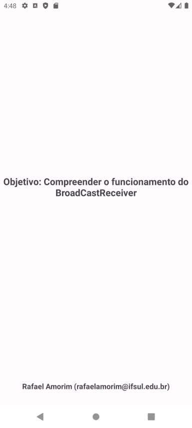

    

# Exemplo de uso do BroadcastReceiver

Repositório criado para mostrar uma aplicação simples usando BroadcastReceiver na disciplina de
Desenvolvimento Mobile II, do curso de Tecnólogo em Analise e Desenvolvimento de Sistemas do
Instituto Federal Sul Riograndense (IFSul), [Campus Santana do Livramento](http://www.santana.ifsul.edu.br/).

## Broadcast e BroadcastReceiver

Um `Broadcast` é uma mensagem que qualquer aplicativo pode receber. O sistema operacional Android e outros aplicativos enviam `Broadcasts` quando eventos de interesse ocorrem. Por exemplo, o sistema Android env-ia `Broadcasts` quando o sistema é inicializado ou quando o dispositivo começa a carregar. Os aplicativos também podem enviar `Broadcasts` personalizados, por exemplo, para notificar outros aplicativos de que algo que lhes interessa aconteceu.

Um `BroadcastReceiver` é um componente que permite que seu aplicativo se registre para `Broadcasts` do sistema e do aplicativo. Embora os `BroadcastReceivers` não exibam uma interface de usuário, eles podem criar uma notificação na barra de status para alertar o usuário quando um evento de `Broadcast` ocorre. Mais comumente, no entanto, um `BroadcastReceiver` é simplesmente um gateway para outros componentes e tem como objetivo realizar uma quantidade mínima de trabalho.

## Screenshot

    

